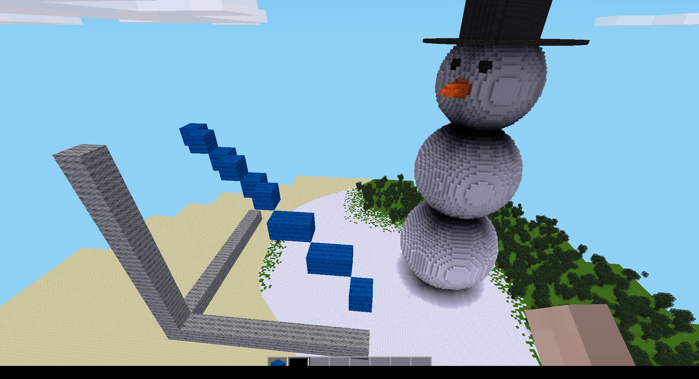

# miney_toolbox

Toolbox to create all sorts of shapes in [Minetest](https://www.minetest.net/) (Minecraft clone) via [Miney](https://pypi.org/project/miney/).

So far you can place flat circles, spheres, rectangles and lines at the position of the selected player with a selected material. More to come.

You can also combine shapes, see the snowman example.

The line procedure was adopted from the [recent c't article "Bresenham 3D"](https://www.heise.de/select/ct/2021/26/2130115371338876887) in the German magazine c't and their [implementation](https://github.com/pinae/BresenhamLidar).

